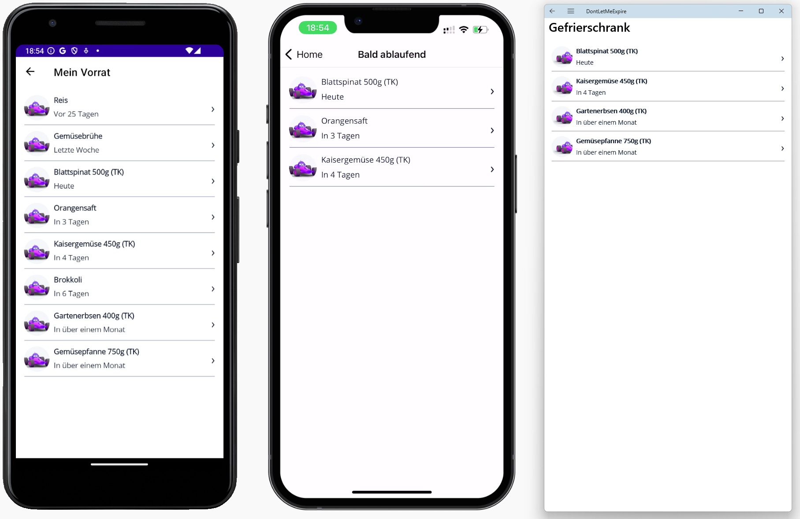

# Übung 5: Startseite / Lagerorte

- Öffnen Sie die App `DontLetMeExpire` in Visual Studio.
- Öffnen Sie die Datei `MainPage.xaml`
- Ersetzen Sie die Dummy `BoxViews` im unteren Bereich (Liste der Lagerorte) mit den drei Kacheln **Gefrierschrank**, **Kühlschrank**, **Vorratsschrank**
- Nutzen Sie statische Dummy Daten für die Anzahl der Einträge in den Kacheln
- Verwenden Sie ein Dummy Bild (entweder BoxView oder dotnet_bot.png)
- Hilfreiche Links:
https://learn.microsoft.com/en-us/dotnet/maui/user-interface/shadow?view=net-maui-9.0 

